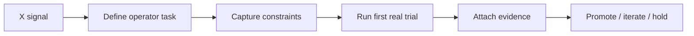

# Computer Use Verifier Workflow

Source: [[UseDesktop as Verifier Infrastructure for Computer-Use Agents]]  
Package: [[Computer Use Verifier Kit]]

## Before
The note is interesting but passive; it can be forgotten or overgeneralized.

## After
The artifact package creates a bounded workflow, evidence packet, and recurring improvement loop.

## Vinay use case
Turn agent-platform announcements into proof-backed product experiments for VinClawLabs, newsletter examples, or reusable Hermes skills.
